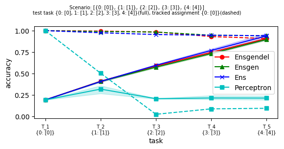
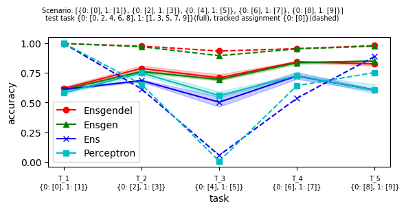
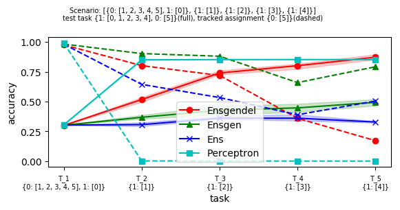

# ensgendel & incremental evaluation framework
This package contains implementation of **ens**emble of **gen**erative models with **del**etion mechanism (ensgendel)
 and the framework for continual learning evaluation.
 
## Requirements
For running ensgendel with GPU, [cupy](https://cupy.dev/) is required.
Tested on python 3.7.4. (only CPU) and 2.7. (with GPU). Excerpts from `pip freeze` command are below.

Python 3.7.4. setup:\
chainer==7.7.0
h5py==2.9.0
matplotlib==3.0.2
numpy==1.17.2
scikit-build==0.11.1
scikit-learn==0.21.3
scipy==1.3.1

Python 2.7. setup:\
chainer==5.2.0
**cupy**==5.2.0
h5py==2.7.1
matplotlib==2.1.0
numpy==1.14.0
scikit-learn==0.19.1
scipy==1.0.0

## Run demo
1. From the project root run the demo application *incremental_evaluation_run.py*\
`python incremental_evaluation_run.py exp1 mnist_cn5 12345 --debug True`\
The application creates *results/incremental_evaluation_run/* file where app stores results of *exp1* experiment.
The `--debug True` option runs only ligthweight classifiers, so this run just tests whether everything works.
2. If no errors showed up in previous experiment, run\
`python incremental_evaluation_run.py exp2 mnist012 234 --scout 1000 --trials 3`\
which creates experiment *exp2* where all predictors are evaluated on *mnist012* scenarios, which operate on pruned
dataset. The results are averaged from three trials.
3. For more options consult the help option\
`python incremental_evaluation_run.py -h`
## Results interpretation
The modes (third argument) 4 and 5 generate results into csv table and pdf plot, respectively.
In the results the predictors are identified by their (python) class names and scenario are identified by their self-descriptive strings.
The scenario name encodes tasks, where each task is defined by its label-subclass assignments.
For instance, scenario `[{0: [2], 1:[3]}, {0: [4]}]` is composed of two tasks, where in the first task `{0: [0], 1:[1]}` the 
classifier is trained on subclass 2 labeled as 0 (e.g., images of twos labeled as 0) and 3 with label 1.
### CSV table
### Accuracy Plot
The mode 5 creates plots with accuracy statistics (e.g., `python incremental_evaluation_run.py exp11 mnist_cn5 5 --trials 3`).\
In `[{0: [0]}, {1: [1]}, {2: [2]}, {3: [3]}, {4: [4]}]` scenario, the classifiers train a new class each task.
The total accuracy, accuracy of all five classes correctly classified, is shown in full lines.  
We also track particular assignment, in this case zeroes being classified as 0 `{0: [0]}` where we can see that 
the Perceptron catastrophically forgets its label in consequent tasks. \
\
In `[{0: [0], 1: [1]}, {0: [2], 1: [3]}, {0: [4], 1: [5]}, {0: [6], 1: [7]}, {0: [8], 1: [9]}]` scenario, the predictors 
train to recognize even (label 0) and odd (label 1) digits incrementally.
Here, only Ensgendel and Ensgen predictors are able to recall that zero is an even number (`{0: [0]}`).\  
\
Finally, the `[{0: [1, 2, 3, 4, 5], 1: [0]}, {1: [1]}, {1: [2]}, {1: [3]}, {1: [4]}]` we test the ability to 
forget when needed. 
Only the Ensgendel and Perceptron are able to forget (although Perceptron also forgets when it is not needed).
The accuracies of Ens and Ensgen barely increases as they don't forget the assignments trained in the first task.
\
## Adding new continual learners and scenarios
You can integrate new continual learners and scenarios by implementing the interfaces **Predictor** and **ScenarioSet**,
 respectively. See interface definitions in *incremental_evaluation/interfaces* for details.